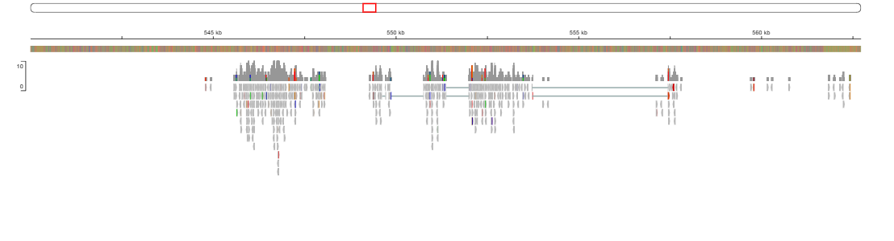
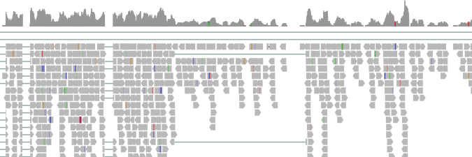
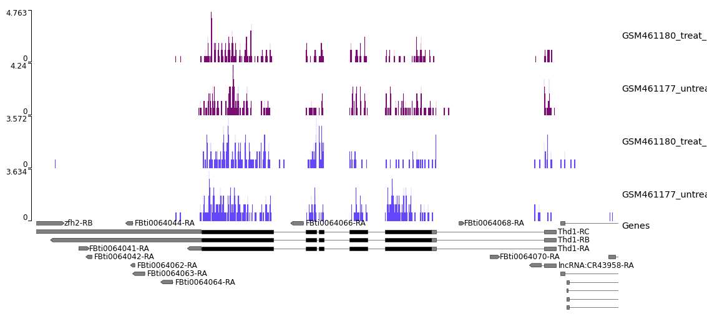

# Reference-based RNA-Seq Data Analysis
### Pasilla Gene Depletion in *Drosophila melanogaster*

> **Course:** Special Topics — Assignment 4  
> **Tutorial:** [Galaxy Training Network — Reference-based RNA-Seq](https://training.galaxyproject.org/training-material/topics/transcriptomics/tutorials/ref-based/tutorial.html)  
> **Platform:** [Galaxy](https://usegalaxy.eu/)

---

## Background

This project follows a complete reference-based RNA-Seq pipeline to identify **differentially expressed genes** in *Drosophila melanogaster* after depletion of the **Pasilla (PS) gene** — the fly homologue of mammalian splicing regulators Nova-1 and Nova-2.

Based on [Brooks et al. 2011](https://www.ncbi.nlm.nih.gov/pmc/articles/PMC3032923/), the PS gene was knocked down via RNAi and total RNA was sequenced from both **treated** (PS-depleted) and **untreated** samples using paired-end RNA-Seq libraries. The goal is to identify genes and pathways whose expression is significantly altered by this depletion.

---

## Samples

| Sample ID | Condition | Library Type | Accession |
|---|---|---|---|
| GSM461177 | Untreated | Paired-end | [SRA](https://www.ncbi.nlm.nih.gov/sra?term=GSM461177) |
| GSM461180 | Treated (PS-depleted) | Paired-end | [SRA](https://www.ncbi.nlm.nih.gov/sra?term=GSM461180) |

Reference genome: *Drosophila melanogaster* BDGP6.32 (dm6)  
Annotation: Ensembl release 109 (`Drosophila_melanogaster.BDGP6.32.109_UCSC.gtf`)

---

## Pipeline Overview

```
Raw FASTQ files
      │
      ▼
[1] Quality Control          Falco → MultiQC → Cutadapt → MultiQC
      │
      ▼
[2] Mapping                  RNA STAR (spliced aligner) → MultiQC
      │
      ▼
[3] Strand Coverage          STAR coverage plots · Infer Experiment · pyGenomeTracks
      │
      ▼
[4] Read Counting            featureCounts → MultiQC
      │
      ▼
[5] Differential Expression  DESeq2 → PCA · Heatmap · MA plot
      │
      ▼
[6] DE Gene Visualization    Heatmap (normalized counts) · Z-score heatmap
      │
      ▼
[7] Functional Enrichment    GOseq (GO + KEGG) · Pathview
```

---

## Key Results Summary

### Alignment (STAR)

| Sample | Total Reads | Aligned | Uniquely Aligned | Avg. Mapped Length |
|---|---|---|---|---|
| GSM461177 (untreat_paired) | 1.0M | 88.6% | 83.1% | 72.9 bp |
| GSM461180 (treat_paired) | 1.1M | 83.5% | 79.0% | 70.5 bp |

### Read Assignment (featureCounts)

| Sample | Assigned Reads |
|---|---|
| GSM461177 (untreat_paired) | 63.0% |
| GSM461180 (treat_paired) | 63.0% |

### Differential Expression (DESeq2)

| Filter | Genes |
|---|---|
| Adjusted p-value < 0.05 | — |
| \|log₂FC\| > 1 AND adj p < 0.05 | **113 genes** |

### PCA

The PCA plot from DESeq2 shows clear separation:
- **PC1** separates **treated vs. untreated** samples
- **PC2** separates **paired-end vs. single-end** datasets

No hidden batch effects were detected — samples cluster cleanly by their biological condition.

---

## IGV Visualization

Alignment tracks were inspected in IGV at two loci:

**chr4:540,000–560,000**



**chr3R:9,445,000–9,448,000**



---

## Strand Coverage

STAR strand coverage was visualized using pyGenomeTracks:



> Strand 1 shown in **blue**, Strand 2 shown in **red**.

---

## KEGG Pathway Overlays (Pathview)

Two KEGG pathways were visualized with log₂FC values overlaid:

| Pathway | ID | Status |
|---|---|---|
| Glycolysis / Gluconeogenesis | dme00010 | Over-represented |
| Spliceosome | dme03040 | Under-represented |

`07_functional_enrichment/Pathview_ KEGG Pathways/dme00010.png`  
`07_functional_enrichment/Pathview_ KEGG Pathways/dme03040.png`

---

## Repository Structure

```
rnaseq_analysis/
│
├── README.md                          ← You are here
├── data/
│   └── sample_info.md                 ← Sample metadata and accessions
│
├── 01_quality_control/
│   ├── README.md                      ← QC methods and interpretation
│   ├── multiqc_raw_report_after_falco_html.html
│   └── multiqc_after_cutadapt_report_html.html
│
├── 02_mapping/
│   ├── README.md                      ← STAR parameters and alignment stats
│   ├── multiqc_star_report_html.html
│   ├── igv_chr4_540k-560k.png
│   └── igv_chr3R_9445k-9448k.png
│
├── 03_strand_coverage/
│   ├── README.md                      ← Strandness estimation methods
│   ├── pyGenomeTracks_for_strandness.png
│   ├── multiqc_star_reads_per_gene_html.html
│   └── infer_experiment_PE/
│       ├── infer_experiment_treat_paired.txt
│       └── infer_experiment_untreat_paired.txt
│
├── 04_read_counting/
│   ├── README.md                      ← featureCounts settings and output summary
│   ├── multiqc_featurecounts_html.html
│   └── featurecounts_PE/
│       ├── featurecounts_treat_paired.tabular
│       └── featurecounts_untreat_paired.tabular
│
├── 05_differential_expression/
│   ├── README.md                      ← DESeq2 design, factors, results interpretation
│   ├── Galaxy8-[deseq2_results_annotated].tabular
│   ├── Galaxy9-[deseq2_plots].pdf
│   ├── Galaxy10-[deseq2_normalized_counts].tabular
│   └── Galaxy16-[Genes with significant adj p-value & abs(log2(FC)) _ 1].tabular
│
├── 06_de_gene_visualization/
│   ├── README.md                      ← Heatmap and Z-score plot description
│   ├── Galaxy19-[heatmap_normalized_counts].pdf
│   └── Galaxy20-[zscore_heatmap].pdf
│
└── 07_functional_enrichment/
    ├── README.md                      ← GO and KEGG analysis and biological interpretation
    ├── deseq2_normalized_counts.tabular
    ├── goseq_GO_category list - Wallenius method.tabular
    ├── goseq_GO_DE_genes_for_categories.tabular
    ├── goseq_KEGG_category list - Wallenius method.tabular
    ├── goseq_KEGG_DE_genes_for_categories.tabular
    ├── goseq_top10_GO_barplot.pdf
    └── Pathview_ KEGG Pathways/
        ├── dme00010.png
        └── dme03040.png
```

Each numbered folder contains a `README.md` with the step-by-step description of tools used, parameters chosen, and interpretation of outputs.

---

## Tools Used

| Tool | Purpose |
|---|---|
| Falco | Raw read quality assessment |
| Cutadapt | Adapter trimming |
| MultiQC | Aggregating QC reports |
| RNA STAR | Spliced read alignment |
| IGV | Visual inspection of alignments |
| pyGenomeTracks | Strand coverage visualization |
| Infer Experiment | Library strandness estimation |
| featureCounts | Read counting per gene |
| DESeq2 | Differential expression analysis |
| heatmap2 | Expression heatmaps |
| GOseq | GO and KEGG enrichment |
| Pathview | KEGG pathway visualization |

---

*All analysis was performed on [Galaxy](https://usegalaxy.eu/) following the GTN tutorial linked above.*
